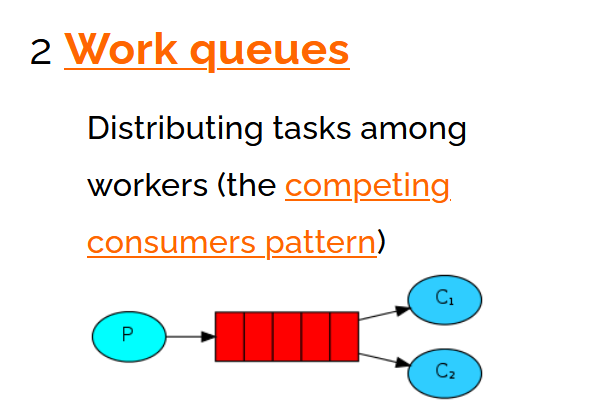
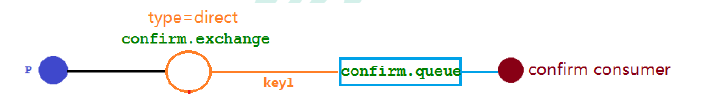

## 1、rabbitmq介绍

### 1.1、工作原理图


### 1.2、各名词解释

#### 1.2.1、Broker

> Broker：接收和分发消息的应用，RabbitMQ Server就是Message Broker`其中包括exchange和queue`

#### 1.2.2、Virtual host

> Virtual host：出于多租户和安全因素设计的，把 AMQP 的基本组件划分到一个虚拟的分组中，类似于网络中的namespace概念。当多个不同的用户使用同一个RabbitMQ server提供的服务时，可以划分出多个vhost，每个用户在自己的 vhost 创建 exchange／queue 等

#### 1.2.3、Connection

> Connection：publisher／consumer和broker之间的TCP连接

#### 1.2.4、Channel

> Channel：如果每一次访问 RabbitMQ 都建立一个Connection，在消息量大的时候建立 TCP Connection的开销将是巨大的，效率也较低。Channel是在connection内部建立的逻辑连接，如果应用程序支持多线程，通常每个thread创建单独的channel进行通讯，AMQP method包含了channel id 帮助客户端和message broker 识别 channel，所以channel之间是完全隔离的。Channel作为轻量级的Connection极大减少了操作系统建立TCP connection的开销

#### 1.2.5、Exchange

> Exchange：message 到达 broker 的第一站，根据分发规则，匹配查询表中的 routing key，分发消息到queue 中去。常用的类型有：direct (point-to-point), topic (publish-subscribe) and fanout (multicast)

#### 1.2.6、Queue

> Queue：消息最终被送到这里等待consumer取走

#### 1.2.7、Binding

> Binding：exchange和queue之间的虚拟连接，binding中可以包含routing key，Binding信息被保存到exchange中的查询表中，用于message的分发依据

### 1.3、rabbitmq安装

#### 1.3.1、docker-compose文件

```yml
version: "3.0"
networks:
  container:
    driver: bridge
volumes:
  esconfig:
  esdata:
services:
  mysql:
    image: mysql:8.0.26
    container_name: mysql
    ports:
      - "3306:3306"
    volumes:
      - "./mysql/data:/var/lib/mysql"
      - "./mysql/conf.d:/etc/mysql/conf.d"
      - "/etc/localtime:/etc/localtime:ro"
    environment:
      - "MYSQL_ROOT_PASSWORD=ljzyou2513"
      - "TZ=Asia/Shanghai"
      - "SET_CONTAINER_TIMEZONE=true"
      - "CONTAINER_TIMEZONE=Asia/Shanghai"
    restart: always
    networks:
      container:

  redis:
    image: redis:6.2.6
    privileged: true
    container_name: redis
    volumes:
      - "./redis/data:/data:rw"
      - "./redis/redis.conf:/usr/local/etc/redis/redis.conf:rw"
    restart: always
    command: redis-server /usr/local/etc/redis/redis.conf --requirepass "ljzyou2513"
    ports:
      - "6379:6379"
    environment:
      - "TZ=Asia/Shanghai"
      - "LANG=en_US.UTF-8"
    networks:
      container:

  nginx:
    image: nginx:1.18.0
    container_name: nginx
    restart: always
    hostname: nginx
    privileged: true
    ports:
      - "80:80"
    volumes:
      - "./nginx/logs:/var/log/nginx/"
      - "./nginx/nginx.conf:/etc/nginx/nginx.conf:rw"
      - "./nginx/html:/usr/share/nginx/html/"
    networks:
      container:

  nacos:
    image: nacos/nacos-server:v1.4.3
    container_name: nacos
    restart: always
    privileged: true
    ports:
      - "8848:8848"
    depends_on:
      - mysql
    volumes:
      - "./nacos/data:/home/nacos/data"
      - "./nacos/plugins:/home/nacos/plugins"
      - "./nacos/application.properties:/home/nacos/conf/application.properties"
    environment:
      - "MODE=standalone"
      - "JVM_XMS=256m"
      - "JVM_MMS=256m"
    networks:
      container:

  rabbitmq:
    image: rabbitmq:3.8.30
    container_name: rabbitmq
    restart: always
    volumes:
      - "./rabbitmq/data:/var/lib/rabbitmq/"
    ports:
      - "5672:5672"
      - "15672:15672"
    networks:
      container:

#  rocketmq-namesrv:
#    image: foxiswho/rocketmq:4.8.0
#    container_name: rocketmq-namesrv
#    restart: always
#    ports:
#      - 9876:9876
#    volumes:
#      # ./namesrv/logs 主机路径（docker-compose.yml的相对路径）：/home/rocketmq/logs 容器内路径
#      - "./rocketmq/logs:/home/rocketmq/logs"
#      - "./rocketmq/namesrv/store:/home/rocketmq/store"
#    environment:
#      JAVA_OPT_EXT: "-Duser.home=/home/rocketmq -Xms256M -Xmx256M -Xmn128m"
#    command: ["sh","mqnamesrv"]
#    networks:
#      container:
#
#
#  rocketmq-broker:
#    image: foxiswho/rocketmq:4.8.0
#    container_name: rocketmq-broker
#    restart: always
#    ports:
#      - "10909:10909"
#      - "10911:10911"
#    volumes:
#      - "./rocketmq/logs:/home/rocketmq/logs"
#      - "./rocketmq/store:/home/rocketmq/store"
#      - "./rocketmq/conf:/etc/rocketmq/broker.conf:rw"
#    environment:
#      JAVA_OPT_EXT: "-Duser.home=/home/rocketmq -Xms256M -Xmx256M -Xmn128m"
#      # 容器内路径
#    command: ["sh","mqbroker","-c","/etc/rocketmq/broker.conf","-n","rocketmq-namesrv:9876","autoCreateTopicEnable=true"]
#    depends_on:
#      - rocketmq-namesrv
#    networks:
#      container:
#
#  rocketmq-console:
#    image: styletang/rocketmq-console-ng
#    container_name: rocketmq-console
#    restart: always
#    ports:
#      - "10912:8080"
#    environment:
#      JAVA_OPTS: "-Drocketmq.namesrv.addr=rocketmq-namesrv:9876 -Dcom.rocketmq.sendMessageWithVIPChannel=false"
#    depends_on:
#      - rocketmq-namesrv
#    networks:
#      container:

  elasticsearch:
    image: elasticsearch:7.14.0
    container_name: elasticsearch
    volumes:
      - "esdata:/usr/share/elasticsearch/data"
      - "esconfig:/usr/share/elasticsearch/config"
      - "./elasticsearch/ik-7.14.0:/usr/share/elasticsearch/plugins/ik-7.14.0"
    ports:
      - "9200:9200"
      - "9300:9300"
    environment:
      - "discovery.type=single-node"
      - "ES_JAVA_OPTS=-Xms256m -Xmx256m"
    restart: always
    privileged: true
    networks:
      container:

  ibana:
   image: kibana:7.14.0
   container_name: kibana
   volumes:
     - "./kibana/kibana.yml:/usr/share/kibana/config/kibana.yml"
   ports:
     - "5601:5601"
   restart: always
   privileged: true
   depends_on:
     - elasticsearch
   networks:
     container:

  portainer:
    image: portainer/portainer:latest
    container_name: portainer
    ports:
      - "9000:9000"
    volumes:
      - "/var/run/docker.sock:/var/run/docker.sock"
    privileged: true
    restart: always
    networks:
      container:

```

#### 1.3.2、启用插件

> **启用客户端插件**

```tex
# 进入容器中
docker exec -it <rabbitmq容器id> bash
# 执行
rabbitmq-plugins enable rabbitmq_management
重启容器
```

> **启用channel**

```tex
docker exec -it rabbitmq /bin/bash
cd /etc/rabbitmq/conf.d/
echo management_agent.disable_metrics_collector = false > management_agent.disable_metrics_collector.conf
重启容器
```

> **启用延时队列插件**

```tex
去github下载 https://github.com/rabbitmq/rabbitmq-delayed-message-exchange
docker cp /vdb/lib/rabbitmq_delayed_message_exchange-3.8.0.ez 容器id:/plugins
rabbitmq-plugins enable rabbitmq_delayed_message_exchange
重启容器
```

## 2、rabbitmq中的helloword模式


### 2.1、生产者

```java
public class Provider {

    @Test
    public void testSendMessage() throws IOException, TimeoutException {
        ConnectionFactory factory = new ConnectionFactory();
        // 设置rabbitmq的主机
        factory.setHost("192.168.75.128");
        factory.setPort(5672);
        factory.setUsername("ems");
        factory.setPassword("ems");
        factory.setVirtualHost("/ems");
        // 通过连接工厂获取一个连接
        Connection connection = factory.newConnection();
        // 获取连接通道
        Channel channel = connection.createChannel();
        // 通道绑定对应的消息队列
        //参数1:  队列名称 如果队列不存在自动创建
        //参数2:  用来定义队列特性是否要持久化 true 持久化队列   false 不持久化
        //参数3:  exclusive 是否独占队列  true 独占队列   false  不独占(是否只能由一个消费者消费)
        //参数4:  autoDelete: 是否在消费完成后自动删除队列  true 自动删除  false 不自动删除
        //参数5:  额外附加参数
        channel.queueDeclare("hello", true, false, false, null);

        //发布消息

        //参数1: 交换机名称 参数2:队列名称  参数3:传递消息额外设置  参数4:消息的具体内容
        channel.basicPublish("", "hello", MessageProperties.PERSISTENT_TEXT_PLAIN,
                "hello rabbitmq".getBytes(StandardCharsets.UTF_8));
        channel.close();
        connection.close();
    }
}
```

### 2.2、消费者

```java
public class Customer {
    @Test
    public void testCustomerMessage() throws IOException, TimeoutException {
        ConnectionFactory factory = new ConnectionFactory();
        // 设置rabbitmq的主机
        factory.setHost("192.168.75.128");
        factory.setPort(5672);
        factory.setUsername("ems");
        factory.setPassword("ems");
        factory.setVirtualHost("/ems");
        // 通过连接工厂获取一个连接
        Connection connection = factory.newConnection();
        // 获取连接通道
        Channel channel = connection.createChannel();
        // 通道绑定对应的消息队列
        //参数1:  队列名称 如果队列不存在自动创建
        //参数2:  用来定义队列特性是否要持久化 true 持久化队列   false 不持久化
        //参数3:  exclusive 是否独占队列  true 独占队列   false  不独占
        //参数4:  autoDelete: 是否在消费完成后自动删除队列  true 自动删除  false 不自动删除
        //参数5:  额外附加参数
        channel.queueDeclare("hello",true,false,false,null);
        // 消费消息
        // 参数1:消费那个队列的消息队列名称
        // 参数2:开始消息的自动确认机制
        // 参数3:消费时的回调接口
        channel.basicConsume("hello", true, new DefaultConsumer(channel){
            @Override
            public void handleDelivery(String consumerTag, Envelope envelope, AMQP.BasicProperties properties, byte[] body) throws IOException {
                System.out.println("接收的消息 ==> " + new String(body));
            }

            @Override
            public void handleCancel(String consumerTag) throws IOException {
                System.out.println("消费消息被中断");
            }
        });

        channel.close();
        connection.close();
    }
}
```

## 3、work模式(默认轮询)



### 3.1、生产者

```java
public class Provider {
    public static void main(String[] args) throws IOException {
        Connection connection = RabbitMqUtils.getConnection();
        assert connection != null;
        Channel channel = connection.createChannel();
        // 通道绑定对应的消息队列
        //参数1:  队列名称 如果队列不存在自动创建
        //参数2:  用来定义队列特性是否要持久化 true 持久化队列   false 不持久化
        //参数3:  exclusive 是否独占队列  true 独占队列   false  不独占(是否只能由一个消费者消费)
        //参数4:  autoDelete: 是否在消费完成后自动删除队列  true 自动删除  false 不自动删除
        //参数5:  额外附加参数
        channel.queueDeclare("work", true, false, false, null);
        //发布消息
        //参数1: 交换机名称
        // 参数2:队列名称
        // 参数3:传递消息额外设置 (设置生产者发送消息为持久化消息(要求保存到磁盘上) 保存在内存中)
        // 参数4:消息的具体内容
        for (int i = 0; i < 10; i++) {
            channel.basicPublish("", "work",
                    MessageProperties.PERSISTENT_TEXT_PLAIN, ("work" + i).getBytes(StandardCharsets.UTF_8));
        }
        //RabbitMqUtils.closeConnectionAndChanel(channel, connection);
    }
}
```

### 3.2、消费者1

```java
public class Customer {
    public static void main(String[] args) throws IOException {
        Connection connection = RabbitMqUtils.getConnection();
        assert connection != null;
        Channel channel = connection.createChannel();
        // 设置不公平消费
        channel.basicQos(4);
        channel.queueDeclare("work", true, false, false, null);
        channel.basicConsume("work", false, new DefaultConsumer(channel){
            @Override
            public void handleCancel(String consumerTag) throws IOException {
                System.out.println("Customer 取消的消息的消费");
            }

            @Override
            public void handleDelivery(String consumerTag, Envelope envelope, AMQP.BasicProperties properties, byte[] body) throws IOException {
                try {
                    Thread.sleep(1_000);
                } catch (InterruptedException e) {
                    e.printStackTrace();
                }
                System.out.println("Customer 消费的消息体 == >" + new String(body));

                // 手动应答
                // 参数1: 收到的AMQP.Basic.GetOk或AMQP.Basic.Deliver的标签
                // 参数2: 是否批量应答 false- 处理一个应答一个
                channel.basicAck(envelope.getDeliveryTag(), false);
            }
        });
        //RabbitMqUtils.closeConnectionAndChanel(channel, connection);
    }
}
```

### 3.3、消费者2

```java
public class Customer1 {
    public static void main(String[] args) throws IOException {
        Connection connection = RabbitMqUtils.getConnection();
        assert connection != null;
        Channel channel = connection.createChannel();
        // 设置不公平消费
        channel.basicQos(6);
        channel.queueDeclare("work", true, false, false, null);
        channel.basicConsume("work", false, new DefaultConsumer(channel){
            @Override
            public void handleCancel(String consumerTag) throws IOException {
                System.out.println("Customer 取消的消息的消费");
            }

            @Override
            public void handleDelivery(String consumerTag, Envelope envelope, AMQP.BasicProperties properties, byte[] body) throws IOException {
                try {
                    Thread.sleep(10_000);
                } catch (InterruptedException e) {
                    e.printStackTrace();
                }
                System.out.println("Customer1 消费的消息体 == >" + new String(body));

                // 手动应答
                // 参数1: 收到的AMQP.Basic.GetOk或AMQP.Basic.Deliver的标签
                // 参数2: 是否批量应答 false- 处理一个应答一个
                channel.basicAck(envelope.getDeliveryTag(), false);
            }
        });
        //RabbitMqUtils.closeConnectionAndChanel(channel, connection);
    }
}
```

### 3.4、可设置不公平消费和预取值

>// 设置不公平消费
>  channel.basicQos(6);

### 3.5、消息应答

> 消费者完成一个任务可能需要一段时间，如果其中一个消费者处理一个长的任务并仅只完成了部分突然它挂掉了，会发生什么情况。RabbitMQ一旦向消费者传递了一条消息，便立即将该消息标记为删除。在这种情况下，突然有个消费者挂掉了，我们将丢失正在处理的消息。以及后续发送给该消费这的消息，因为它无法接收到。

#### 3.5.1、自动应答

>// 消费消息
>        // 参数1:消费那个队列的消息队列名称
>        // 参数2:开始消息的自动确认机制
>        // 参数3:消费时的回调接口
>        channel.basicConsume("hello", true, new DefaultConsumer(channel)

#### 3.5.2、手动应答

>// 手动应答
>    // 参数1: 收到的AMQP.Basic.GetOk或AMQP.Basic.Deliver的标签
>    // 参数2: `multiple`是否批量应答 false- 处理一个应答一个
>    channel.basicAck(envelope.getDeliveryTag(), false);

可调用的方法

> A.Channel.basicAck(用于肯定确认)
>
> ​	RabbitMQ已知道该消息并且成功的处理消息，可以将其丢弃了
>
> B.Channel.basicNack(用于否定确认)
>
> C.Channel.basicReject(用于否定确认)
>
> ​	与Channel.basicNack相比少一个参数
> 不处理该消息了直接拒绝，可以将其丢弃了

#### 3.5.3、手动提交中的multiple参数解释

>multiple的true和false代表不同意思
>
>​		true代表批量应答channel上未应答的消息
>
>​			比如说channel上有传送tag的消息 5,6,7,8 当前tag是8 那么此时5-8的这些还未应答的消息都会被确认收到消息应答
>
>​	false同上面相比
>
>​		只会应答tag=8的消息 5,6,7这三个消息依然不会被确认收到消息应答


## 4、持久化

### 4.1、队列持久化(参数2)

```java
// 通道绑定对应的消息队列
//参数1:  队列名称 如果队列不存在自动创建
//参数2:  用来定义队列特性是否要持久化 true 持久化队列   false 不持久化
//参数3:  exclusive 是否独占队列  true 独占队列   false  不独占(是否只能由一个消费者消费)
//参数4:  autoDelete: 是否在消费完成后自动删除队列  true 自动删除  false 不自动删除
//参数5:  额外附加参数
channel.queueDeclare("hello", true, false, false, null);
```

### 4.2、消息持久化(参数3:传递消息额外设置)

```java
//参数1: 交换机名称 参数2:队列名称  参数3:传递消息额外设置  参数4:消息的具体内容
channel.basicPublish("", "hello", MessageProperties.PERSISTENT_TEXT_PLAIN,
        "hello rabbitmq".getBytes(StandardCharsets.UTF_8));
```

## 5、发布确认模式

### 5.1、开启发布确认的方法

>// 开启消息确认
>  channel.confirmSelect();

### 5.2、单个确认发布

```java
// 单个确认发布
    public static void singleConfirmedRelease() throws IOException, InterruptedException {
        Connection connection = RabbitMqUtils.getConnection();
        assert connection != null;
        Channel channel = connection.createChannel();
        // 开启消息确认
        channel.confirmSelect();
        channel.queueDeclare("confirm", true, false, false, null);
        long begin = System.currentTimeMillis();
        
        for (int i = 0; i < 100; i++) {
            channel.basicPublish("", "confirm",
                    MessageProperties.PERSISTENT_TEXT_PLAIN, ("provider" + i).getBytes(StandardCharsets.UTF_8));
            boolean flag = channel.waitForConfirms();
            if (flag) {
                System.out.println(i + "消息发布成功");
            }
        }
        long end = System.currentTimeMillis();
        System.out.println("发布消息花费的时间" + (end - begin));
    }
```

### 5.3、批量发布确认

```java
// 批量发布确认
    public static void batchReleaseConfirmation() throws IOException, InterruptedException {
        Connection connection = RabbitMqUtils.getConnection();
        assert connection != null;
        Channel channel = connection.createChannel();
        // 开启消息确认
        channel.confirmSelect();
        channel.queueDeclare("confirm", true, false, false, null);
        long begin = System.currentTimeMillis();
        for (int i = 0; i < 100; i++) {
            channel.basicPublish("", "confirm",
                    MessageProperties.PERSISTENT_TEXT_PLAIN, ("provider" + i).getBytes(StandardCharsets.UTF_8));
            // 每 10 条就进行批量确认
            if (i % 10 == 0) {
                channel.waitForConfirms();
            }
        }
        long end = System.currentTimeMillis();
        System.out.println("发布消息花费的时间" + (end - begin));
    }
```

### 5.4、异步确认发布

```java
// 异步确认发布
    public static void asynAcknowledgmentRelease() throws IOException, InterruptedException {
        Connection connection = RabbitMqUtils.getConnection();
        assert connection != null;
        Channel channel = connection.createChannel();
        // 开启消息确认
        channel.confirmSelect();
        /*
          线程安全有序的一个哈希表适用于高并发的情况下
          1.轻松的将序号与消息进行关联
          2.轻松批量删除条目只要给到序号
          3.支持高并发(多线程)
        */
        ConcurrentSkipListMap<Long, String> outstandingConfirm = new ConcurrentSkipListMap<>();

        channel.queueDeclare("confirm", true, false, false, null);
        // 准备消息监听器，监听那些消息成功了，那些消息失败了
        channel.addConfirmListener(
                // 成功确认
                (deliveryTag, multiple) -> {
                    // 2. 确认成功后移除确认的消息
                    // 如果是批量确认
                    if(multiple){
                        ConcurrentNavigableMap<Long, String> confirmed = outstandingConfirm.headMap(deliveryTag);
                        confirmed.clear();
                    }
                    // 不是批量删除
                    else{
                        outstandingConfirm.remove(deliveryTag);
                    }
                    outstandingConfirm.remove(deliveryTag);
                    System.out.println(deliveryTag + "消息确认成功");
                },
                // 确认失败
                (deliveryTag, multiple) -> {
                    // 3. 打印未确认消息
                    outstandingConfirm.get(deliveryTag);
                    System.out.println(deliveryTag + "消息确认失败");
                });
        long begin = System.currentTimeMillis();
        for (int i = 0; i < 100; i++) {
            channel.basicPublish("", "confirm",
                    MessageProperties.PERSISTENT_TEXT_PLAIN, ("provider" + i).getBytes(StandardCharsets.UTF_8));
            // 1. 将发布的消息添加到 outstandingConfirm 中
            outstandingConfirm.put(channel.getNextPublishSeqNo(), ("provider" + i));
        }
        long end = System.currentTimeMillis();
        System.out.println("发布消息花费的时间" + (end - begin));
    }
```

## 6、交换机

### 6.1、Exchanges的类型

> 直接(direct), 主题(topic) ,标题(headers) , 扇出(fanout)

### 6.2、临时队列

> 每当我们连接到Rabbit时，我们都需要一个全新的空队列，为此我们可以创建一个具有随机名称的队列，或者能让服务器为我们选择一个随机队列名称那就更好了。其次一旦我们断开了`消费者的连接，队列将被自动删除`。

### 6.3、绑定(bindings)

> 什么是bingding呢，binding其实是exchange和queue之间的桥梁，它告诉我们exchange和那个队列进行了绑定关系。比如说下面这张图告诉我们的就是X与Q1和Q2进行了绑定

### 6.4、fanout类型(消息将发送给所有和改交换机绑定的队列)

> Fanout这种类型非常简单。正如从名称中猜到的那样，它是将接收到的所有消息广播到它知道的所有队列中。系统中默认有些exchange类型


#### 6.4.1、生产者

```java
public class Provider {
    public static void main(String[] args) throws IOException {
        Connection connection = RabbitMqUtils.getConnection();
        assert connection != null;
        Channel channel = connection.createChannel();
        // 声明一个交换机
        channel.exchangeDeclare("logs", "fanout");
        for (int i = 0; i < 5; i++) {
            channel.basicPublish("logs", "", null, ("message" + i).getBytes(StandardCharsets.UTF_8));
        }
    }
}
```

#### 6.4.2、消费者1

```java
public class Customer {
    public static void main(String[] args) throws IOException {
        Connection connection = RabbitMqUtils.getConnection();
        assert connection != null;
        Channel channel = connection.createChannel();
        // 声明一个交换机
        channel.exchangeDeclare("logs", "fanout");
        // 创建一个临时队列
        String queue = channel.queueDeclare().getQueue();
        // 绑定交换机和队列
        channel.queueBind(queue, "logs", "");
        channel.basicConsume(queue, false, new DefaultConsumer(channel) {
            @Override
            public void handleDelivery(String consumerTag, Envelope envelope, AMQP.BasicProperties properties, byte[] body) throws IOException {
                System.out.println("Customer 接收到的消息是" + new String(body));
                // 手动确认 消费一个确认一个
                channel.basicAck(envelope.getDeliveryTag(), false);
            }

            @Override
            public void handleCancel(String consumerTag) throws IOException {
                System.out.println("消息取消消费");
            }
        });
    }
}
```

#### 6.4.3、消费者2

```java
public class Customer1 {
    public static void main(String[] args) throws IOException {
        Connection connection = RabbitMqUtils.getConnection();
        assert connection != null;
        Channel channel = connection.createChannel();
        // 通道绑定交换机
        channel.exchangeDeclare("logs_direct", "direct");
        // 创建临时队列
        String queue = channel.queueDeclare().getQueue();
        // 绑定交换机和队列
        channel.queueBind(queue, "logs_direct", "error");
        channel.basicConsume(queue, true, new DefaultConsumer(channel) {
            @Override
            public void handleDelivery(String consumerTag, Envelope envelope, AMQP.BasicProperties properties, byte[] body) throws IOException {
                System.out.println("消费者2：" + new String(body));
            }
        });

    }
}
```

### 6.5、direct类型(消息将会以routingkey来区分发送给那个队列)

> 消息只去到它绑定的routingKey队列中去。


#### 6.5.1、生产者

```java
public class Provider {
    public static void main(String[] args) throws IOException {
        Connection connection = RabbitMqUtils.getConnection();
        assert connection != null;
        Channel channel = connection.createChannel();
        channel.exchangeDeclare("direct_logs", BuiltinExchangeType.DIRECT);
        channel.basicPublish("direct_logs", "error",
                MessageProperties.PERSISTENT_TEXT_PLAIN, "error消息".getBytes(StandardCharsets.UTF_8));
    }
}
```

#### 6.5.2、消费者1

```java
public class Customer {
    public static void main(String[] args) throws IOException {
        Connection connection = RabbitMqUtils.getConnection();
        assert connection != null;
        Channel channel = connection.createChannel();
        channel.exchangeDeclare("direct_logs", BuiltinExchangeType.DIRECT);
        channel.queueDeclare("info", true, false, false, null);
        channel.queueBind("info", "direct_logs","info");
        channel.basicConsume("info", false, new DefaultConsumer(channel){
            @Override
            public void handleDelivery(String consumerTag, Envelope envelope, AMQP.BasicProperties properties, byte[] body) throws IOException {
                System.out.println("info消息消费者接收到的消息为: " + new String(body));
                channel.basicAck(envelope.getDeliveryTag(), false);
            }
        });
    }
}
```

#### 6.5.3、消费者2

```java
public class Customer1 {
    public static void main(String[] args) throws IOException {
        Connection connection = RabbitMqUtils.getConnection();
        assert connection != null;
        Channel channel = connection.createChannel();
        channel.exchangeDeclare("direct_logs", BuiltinExchangeType.DIRECT);
        channel.queueDeclare("error", true, false, false, null);
        channel.queueBind("error", "direct_logs","error");
        channel.basicConsume("error", false, new DefaultConsumer(channel){
            @Override
            public void handleDelivery(String consumerTag, Envelope envelope, AMQP.BasicProperties properties, byte[] body) throws IOException {
                System.out.println("error消息消费者接收到的消息为: " + new String(body));
                channel.basicAck(envelope.getDeliveryTag(), false);
            }
        });
    }
}
```

### 6.6、Topic类型

> 发送到类型是topic交换机的消息的routing_key不能随意写，必须满足一定的要求，它必须是`一个单词列表，以点号分隔开`。这些单词可以是任意单词，比如说："stock.usd.nyse", "nyse.vmw", "quick.orange.rabbit".这种类型的。当然这个单词列表最多不能超过255个字节。
>
> *(星号)可以代替一个单词
> #(井号)可以替代零个或多个单词

>当一个队列绑定键是`#,`那么这个队列将接收所有数据，就有点像fanout了
>如果队列绑定键当中`没有#和*出现`，那么该队列绑定类型就是direct了

#### 6.6.1、生产者

```java
public class Provider {
    public static void main(String[] args) throws IOException {
        Connection connection = RabbitMqUtils.getConnection();
        assert connection != null;
        Channel channel = connection.createChannel();
        channel.exchangeDeclare("topic_logs", BuiltinExchangeType.TOPIC);
        channel.basicPublish("topic_logs", "info.warning",
                MessageProperties.PERSISTENT_TEXT_PLAIN, "Provider 发送的消息".getBytes(StandardCharsets.UTF_8));
    }
}
```

#### 6.6.2、消费者1

```java
public class Customer {
    public static void main(String[] args) throws IOException {
        Connection connection = RabbitMqUtils.getConnection();
        assert connection != null;
        Channel channel = connection.createChannel();
        channel.exchangeDeclare("topic_logs", BuiltinExchangeType.TOPIC);
        channel.queueDeclare("info", true, false ,false, null);
        channel.queueBind("info", "topic_logs", "*.warning.*");
        channel.basicConsume("info", false, new DefaultConsumer(channel){
            @Override
            public void handleDelivery(String consumerTag, Envelope envelope, AMQP.BasicProperties properties, byte[] body) throws IOException {
                System.out.println("Customer 接收到的消息为: " + new String(body) + "绑定的键为: " + envelope.getRoutingKey());
                channel.basicAck(envelope.getDeliveryTag(), false);
            }
        });
    }
}
```

#### 6.6.3、消费者2

```java
public class Customer1 {
    public static void main(String[] args) throws IOException {
        Connection connection = RabbitMqUtils.getConnection();
        assert connection != null;
        Channel channel = connection.createChannel();
        channel.exchangeDeclare("topic_logs", BuiltinExchangeType.TOPIC);
        channel.queueDeclare("error", true, false ,false, null);
        channel.queueBind("error", "topic_logs", "*.*.error");
        channel.queueBind("error", "topic_logs", "info.#");
        channel.basicConsume("error", false, new DefaultConsumer(channel){
            @Override
            public void handleDelivery(String consumerTag, Envelope envelope, AMQP.BasicProperties properties, byte[] body) throws IOException {
                System.out.println("Customer 接收到的消息为: " + new String(body) + "绑定的键为: " + envelope.getRoutingKey());
                channel.basicAck(envelope.getDeliveryTag(), false);
            }
        });
    }
}
```

## 7、死信队列

### 7.1、概念

先从概念解释上搞清楚这个定义，死信，顾名思义就是无法被消费的消息，字面意思可以这样理解，一般来说，producer将消息投递到broker或者直接到queue里了，consumer从queue取出消息进行消费，但某些时候由于特定的原因导致queue中的某些消息无法被消费，这样的消息如果没有后续的处理，就变成了死信，有死信自然就有了死信队列。

应用场景:为了保证订单业务的消息数据不丢失，需要使用到RabbitMQ的死信队列机制，当消息消费发生异常时，将消息投入死信队列中.还有比如说: 用户在商城下单成功并点击去支付后在指定时间未支付时自动失效


### 7.2、死信的来源

> 消息TTL过期
>
> 队列达到最大长度(队列满了，无法再添加数据到mq中)
>
> 消息被拒绝(basic.reject或basic.nack)并且requeue=false.

### 7.3、ttl过期

#### 7.3.1、生产者

```java
public class Provider {
    public static void main(String[] args) throws IOException {
        Connection connection = RabbitMqUtils.getConnection();
        assert connection != null;
        Channel channel = connection.createChannel();
        channel.exchangeDeclare("normal_exchange", BuiltinExchangeType.DIRECT);
        // 死信消息 设置ttl
         AMQP.BasicProperties properties = new AMQP.BasicProperties()
                 .builder()
                 .expiration("10000")
                 .build();
        for (int i = 0; i < 10; i++) {
            channel.basicPublish("normal_exchange", "normal",
                    null, ("info" + i).getBytes(StandardCharsets.UTF_8));
        }
    }
}
```

#### 7.3.2、消费者1(正常消费)

```java
public class Customer {
    /**
     * 死信队列的来源
     *  1、 消息被拒绝
     *  2、 消息 TTL 过期
     *  3、 消息队列达到最大长度
     * @param args
     * @throws IOException
     */
    public static void main(String[] args) throws IOException {
        Connection connection = RabbitMqUtils.getConnection();
        assert connection != null;
        Channel channel = connection.createChannel();
        Map<String, Object> arguments = new HashMap<>();
        // 正常队列设置死信交换机
        arguments.put("x-dead-letter-exchange", "dead_exchange");
        // 正常队列设置死信 routingKey
        arguments.put("x-dead-letter-routing-key", "dead");

        // 声明正常交换机
        channel.exchangeDeclare("normal_exchange", BuiltinExchangeType.DIRECT);
        // 声明正常队列
        channel.queueDeclare("normal_queue", false,false,false, arguments);
        // 正常队列和正常交换机绑定
        channel.queueBind("normal_queue", "normal_exchange", "normal");

        // 声明死信交换机
        channel.exchangeDeclare("dead_exchange", BuiltinExchangeType.DIRECT);
        // 声明死信队列
        channel.queueDeclare("dead_queue", false,false,false, null);
        // 正常队列和正常交换机绑定
        channel.queueBind("dead_queue", "dead_exchange", "dead");

        channel.basicConsume("normal_queue", false, new DefaultConsumer(channel){
            @Override
            public void handleDelivery(String consumerTag, Envelope envelope, AMQP.BasicProperties properties, byte[] body) throws IOException {
                String str = new String(body);
                if("info5".equals(str)){
                    System.out.println(str + "改消息被拒绝");
                    channel.basicReject(envelope.getDeliveryTag(), false);
                }else{
                    System.out.println("消息为: " + str);
                    channel.basicAck(envelope.getDeliveryTag(), false);
                }
            }
        });
    }
}
```

#### 7.3.3、消费者2(消费死信队列中的消息)

```java
public class Customer1 {
    public static void main(String[] args) throws IOException {
        Connection connection = RabbitMqUtils.getConnection();
        assert connection != null;
        Channel channel = connection.createChannel();
        // 消费死信队列中的消息
        channel.basicConsume("dead_queue", true, new DefaultConsumer(channel){
            @Override
            public void handleDelivery(String consumerTag, Envelope envelope, AMQP.BasicProperties properties, byte[] body) throws IOException {
                System.out.println("消息为: " + new String(body));
            }
        });
    }
}
```

### 7.4、队列达到最大长度

#### 7.3.1、生产者

```java
public class Provider {
    public static void main(String[] args) throws IOException {
        Connection connection = RabbitMqUtils.getConnection();
        assert connection != null;
        Channel channel = connection.createChannel();
        channel.exchangeDeclare("normal_exchange", BuiltinExchangeType.DIRECT);
        for (int i = 0; i < 10; i++) {
            channel.basicPublish("normal_exchange", "normal",
                    null, ("info" + i).getBytes(StandardCharsets.UTF_8));
        }
    }
}
```

#### 7.3.2、消费者1(正常消费)

```java
public class Customer {
    /**
     * 死信队列的来源
     *  1、 消息被拒绝
     *  2、 消息 TTL 过期
     *  3、 消息队列达到最大长度
     * @param args
     * @throws IOException
     */
    public static void main(String[] args) throws IOException {
        Connection connection = RabbitMqUtils.getConnection();
        assert connection != null;
        Channel channel = connection.createChannel();
        Map<String, Object> arguments = new HashMap<>();
        // 正常队列设置死信交换机
        arguments.put("x-dead-letter-exchange", "dead_exchange");
        // 正常队列设置死信 routingKey
        arguments.put("x-dead-letter-routing-key", "dead");
        // 设置队列的最大消息长度
        arguments.put("x-max-length", 6);

        // 声明正常交换机
        channel.exchangeDeclare("normal_exchange", BuiltinExchangeType.DIRECT);
        // 声明正常队列
        channel.queueDeclare("normal_queue", false,false,false, arguments);
        // 正常队列和正常交换机绑定
        channel.queueBind("normal_queue", "normal_exchange", "normal");

        // 声明死信交换机
        channel.exchangeDeclare("dead_exchange", BuiltinExchangeType.DIRECT);
        // 声明死信队列
        channel.queueDeclare("dead_queue", false,false,false, null);
        // 正常队列和正常交换机绑定
        channel.queueBind("dead_queue", "dead_exchange", "dead");

        channel.basicConsume("normal_queue", false, new DefaultConsumer(channel){
            @Override
            public void handleDelivery(String consumerTag, Envelope envelope, AMQP.BasicProperties properties, byte[] body) throws IOException {
                String str = new String(body);
                if("info5".equals(str)){
                    System.out.println(str + "改消息被拒绝");
                    channel.basicReject(envelope.getDeliveryTag(), false);
                }else{
                    System.out.println("消息为: " + str);
                    channel.basicAck(envelope.getDeliveryTag(), false);
                }
            }
        });
    }
}
```

#### 7.3.3、消费者2(消费死信队列中的消息)

```java
public class Customer1 {
    public static void main(String[] args) throws IOException {
        Connection connection = RabbitMqUtils.getConnection();
        assert connection != null;
        Channel channel = connection.createChannel();
        // 消费死信队列中的消息
        channel.basicConsume("dead_queue", true, new DefaultConsumer(channel){
            @Override
            public void handleDelivery(String consumerTag, Envelope envelope, AMQP.BasicProperties properties, byte[] body) throws IOException {
                System.out.println("消息为: " + new String(body));
            }
        });
    }
}
```

### 7.5、消息被拒(代码和队列达到最大长度一致)

>1.消息生产者代码同上生产者一致
>
>2.C1消费者代码(启动之后关闭该消费者 模拟其接收不到消息)
>
>channel.basicReject(envelope.getDeliveryTag(), false);

## 8、延时队列

### 8.1、概念

延时队列,队列内部是有序的，最重要的特性就体现在它的延时属性上，延时队列中的元素是希望在指定时间到了以后或之前取出和处理，简单来说，延时队列就是用来存放需要在指定时间被处理的元素的队列。

### 8.2、延迟队列使用场景

1. 订单在十分钟之内未支付则自动取消
2. 新创建的店铺，如果在十天内都没有上传过商品，则自动发送消息提醒。
3. 用户注册成功后，如果三天内没有登陆则进行短信提醒。
4. 用户发起退款，如果三天内没有得到处理则通知相关运营人员。
5. 预定会议后，需要在预定的时间点前十分钟通知各个与会人员参加会议

### 8.3、RabbitMQ中的TTL

TTL是什么呢？TTL是RabbitMQ中一个消息或者队列的属性，表明一条消息或者该队列中的所有消息的最大存活时间，单位是毫秒。换句话说，如果一条消息`设置了TTL属性或者进入了设置TTL属性的队列`，那么这条消息如果在TTL设置的时间内没有被消费，则会成为"死信"。如果同时配置了队列的TTL和消息的TTL，那么``较小的那个值将会被使用``，有两种方式设置TTL。

#### 8.3.1、消息设置ttl


#### 8.3.2、队列设置ttl


#### 8.3.3、区别

​		如果设置了``队列的TTL属性``，那么一旦消息过期，就会被``队列丢弃``(如果配置了死信队列被丢到死信队列中)，而第二种方式，消息即使过期，也不一定会被马上丢弃，因为消息是否过期是在即将投递到消费者之前判定的，如果当前队列有严重的消息积压情况，则已过期的消息也许还能存活较长时间；另外，还需要注意的一点是，如果不设置TTL，表示消息永远不会过期，如果将``TTL设置为0，则表示除非此时可以直接投递该消息到消费者``，否则该消息将会被丢弃。

### 8.4、通过死信队列实现延时队列

​	创建两个队列QA和QB，两者队列TTL分别设置为10S和40S，然后在创建一个交换机X和死信交换机Y，它们的类型都是direct，创建一个死信队列QD，它们的绑定关系如下：


#### 8.4.1、配置文件

```java
@Configuration
public class RabbitMqConfig {
    // 正常交换机
    private static final String NORMAL_EXCHANGE = "normal-exchange";
    // 正常队列 A
    private static final String NORMAL_QUEUE_A = "normal-queue-A";
    // 正常队列 B
    private static final String NORMAL_QUEUE_B = "normal-queue-B";
    // 正常队列 C
    private static final String NORMAL_QUEUE_C = "normal-queue-C";
    // 正常队列 A 的routingKey
    private static final String NORMAL_ROUTINGKEY_A = "normal_A";
    // 正常队列 B 的routingKey
    private static final String NORMAL_ROUTINGKEY_B = "normal_B";
    // 正常队列 C 的routingKey
    private static final String NORMAL_ROUTINGKEY_C = "normal_C";

    // 死信交换机
    private static final String DEAD_EXCHANGE = "dead-exchange";
    // 死信队列
    private static final String DEAD_QUEUE_A = "dead-queue";
    // 死信交换机的 routingKey
    private static final String DEAD_ROUTINGKEY = "dead";
    // 正常交换机
    @Bean
    public DirectExchange normalExchange(){
        return new DirectExchange(NORMAL_EXCHANGE);
    }
    // 正常队列 A
    @Bean
    public Queue normalQueueA(){
        Map<String, Object> arguments = new HashMap<>();
        // 正常队列设置死信交换机
        arguments.put("x-dead-letter-exchange", DEAD_EXCHANGE);
        // 正常队列设置死信 routingKey
        arguments.put("x-dead-letter-routing-key", DEAD_ROUTINGKEY);
        // 声明队列的 TTL
        arguments.put("x-message-ttl", 10_000);
        return QueueBuilder.durable(NORMAL_QUEUE_A).withArguments(arguments).build();
    }

    // 正常队列 B
    @Bean
    public Queue normalQueueB(){
        Map<String, Object> arguments = new HashMap<>();
        // 正常队列设置死信交换机
        arguments.put("x-dead-letter-exchange", DEAD_EXCHANGE);
        // 正常队列设置死信 routingKey
        arguments.put("x-dead-letter-routing-key", DEAD_ROUTINGKEY);
        // 声明队列的 TTL
        arguments.put("x-message-ttl", 40_000);
        return QueueBuilder.durable(NORMAL_QUEUE_B).withArguments(arguments).build();
    }

    // 正常队列 C
    @Bean
    public Queue normalQueueC(){
        Map<String, Object> arguments = new HashMap<>();
        // 正常队列设置死信交换机
        arguments.put("x-dead-letter-exchange", DEAD_EXCHANGE);
        // 正常队列设置死信 routingKey
        arguments.put("x-dead-letter-routing-key", DEAD_ROUTINGKEY);
        return QueueBuilder.durable(NORMAL_QUEUE_C).withArguments(arguments).build();
    }

    // 死信交换机
    @Bean
    public DirectExchange deadExchange(){
        return new DirectExchange(DEAD_EXCHANGE);
    }
    // 死信队列
    @Bean
    public Queue deadQueue(){
        return QueueBuilder.durable(DEAD_QUEUE_A).build();
    }

    // 正常队列 A 和 正常交换机绑定 routingKey 为 NORMAL_A
    @Bean
    public Binding normalExchangeWithNormalQueueA(){
        return BindingBuilder.bind(normalQueueA()).to(normalExchange()).with(NORMAL_ROUTINGKEY_A);
    }
    // 正常队列 B 和 正常交换机绑定 routingKey 为 NORMAL_B
    @Bean
    public Binding normalExchangeWithNormalQueueB(){
        return BindingBuilder.bind(normalQueueB()).to(normalExchange()).with(NORMAL_ROUTINGKEY_B);
    }

    // 正常队列 C 和 正常交换机绑定 routingKey 为 NORMAL_C
    @Bean
    public Binding normalExchangeWithNormalQueueC(){
        return BindingBuilder.bind(normalQueueC()).to(normalExchange()).with(NORMAL_ROUTINGKEY_C);
    }

    // 死信队列 和 死信交换机绑定
    @Bean
    public Binding deadExchangeWithDeadQueue(){
        return BindingBuilder.bind(deadQueue()).to(deadExchange()).with(DEAD_ROUTINGKEY);
    }
}
```

#### 8.4.2、生产者

```java
@GetMapping("/sendMsg/{message}")
@ApiOperation("延时队列(基于死信队列), 创建队列时设定TTL")
public String send(@PathVariable("message") String message) {
   log.info("当前时间为: {}, 发送一条消息给两个TTL队列: {}", new Date(), message);
   rabbitTemplate.convertAndSend("normal-exchange", "normal_A", "ttl为10s的消息" + message);
   rabbitTemplate.convertAndSend("normal-exchange", "normal_B", "ttl为40s的消息" + message);
   return "发送消息成功!!";
}
```

#### 8.4.3、消费者

```java
@RabbitListener(queues = "dead-queue")
public void consumeMessage(Message message) {
    String str = new String(message.getBody());
    log.info("当前时间为: {},收到一条消息: {}", new Date(), str);
}
```

#### 8.4.4、产生的问题

​	不过，如果这样使用的话，岂不是每增加一个新的时间需求，就要新增一个队列，这里只有10S和40S两个时间选项，如果需要一个小时后处理，那么就需要增加TTL为一个小时的队列，如果是预定会议室然后提前通知这样的场景，岂不是要增加无数个队列才能满足需求？

#### 8.4.5、优化


生产者

```java
@GetMapping("/sendMsg/setTTL/{message}/{TTL}")
@ApiOperation("延时队列(基于死信队列), 生产消息时给定TTL")
public String send(@PathVariable("message") String message, @PathVariable("TTL") String TTL) {
    log.info("当前时间为: {}, 发送一条{}ms过期的消息给TTL队列: {}", new Date(), TTL, message);
    rabbitTemplate.convertAndSend("normal-exchange",
             "normal_C",
             "ttl为" + TTL + "ms的消息" + message,
             (msg) -> {
                 msg.getMessageProperties().setExpiration(TTL);
                 return msg;
             });
     return "发送消息成功!!";
}
```

​		看起来似乎没什么问题，但是在最开始的时候，就介绍过如果使用在消息属性上设置TTL的方式，消息可能并不会按时“死亡“，因为RabbitMQ只会检查第一个消息是否过期，如果过期则丢到死信队列，如果第一个消息的延时时长很长，而第二个消息的延时时长很短，第二个消息并不会优先得到执行。

### 8.5、Rabbitmq插件实现延迟队列

上文中提到的问题，确实是一个问题，如果不能实现在消息粒度上的TTL，并使其在设置的TTL时间及时死亡，就无法设计成一个通用的延时队列。那如何解决呢，接下来我们就去解决该问题。

#### 8.5.1、代码架构图


#### 8.5.2、配置文件类代码

```java
@Configuration
public class DelayedQueueConfig {
    // 延时队列
    public static final String DELAYED_QUEUE = "delayed-queue";
    // 延时交换机
    public  static final String DELAYED_EXCHANGE = "delayed-exchange";
    // 延时的 routingKey
    public  static final String DELAYED_ROUTING_KEY = "delayed-routing-key";

    // 声明一个自定义交换机
    @Bean
    public CustomExchange delayedExchange(){
        Map<String, Object> arguments = new HashMap<>();
        arguments.put("x-delayed-type", "direct");
        return new CustomExchange(DELAYED_EXCHANGE, "x-delayed-message",true, false, arguments);
    }
    // 声明一个队列
    @Bean
    public Queue delayedQueue(){
        return QueueBuilder.durable(DELAYED_QUEUE).build();
    }

    // 队列绑定交换机
    @Bean
    public Binding delayedExchangeWithDelayedQueue(){
        return BindingBuilder.bind(delayedQueue()).to(delayedExchange()).with(DELAYED_ROUTING_KEY).noargs();
    }
}
```

#### 8.5.3、生产者

```java
@GetMapping("/sendMsg/delayed/{message}/{TTL}")
@ApiOperation("延时队列(基于插件), 生产消息时给定TTL")
public String send1(@PathVariable("message") String message, @PathVariable("TTL") Integer TTL) {
    log.info("当前时间为: {}, 发送一条{}ms过期的消息给TTL队列: {}", new Date(), TTL, message);
    rabbitTemplate.convertAndSend("delayed-exchange",
            "delayed-routing-key",
            "ttl为" + TTL + "ms的延迟消息" + message,
             (msg) -> {
                 msg.getMessageProperties().setDelay(TTL);
                 return msg;
             });
    return "发送延迟消息成功!!";
}
```

#### 8.5.4、消费者

```java
@RabbitListener(queues = "delayed-queue")
public void consumeMessage(Message message) {
    String str = new String(message.getBody());
    log.info("当前时间为: {}, 收到一条消息: {}", new Date(), str);
}
```

#### 8.5.5、总结

​	延时队列在需要延时处理的场景下非常有用，使用RabbitMQ来实现延时队列可以很好的利用RabbitMQ的特性，如：消息可靠发送、消息可靠投递、死信队列来保障消息至少被消费一次以及未被正确处理的消息不会被丢弃。另外，通过RabbitMQ集群的特性，可以很好的解决单点故障问题，不会因为单个节点挂掉导致延时队列不可用或者消息丢失。
当然，延时队列还有很多其它选择，比如利用Java的DelayQueue，利用``Redis的zset`，利用Quartz或者利用kafka的时间轮，这些方式各有特点,看需要适用的场景

## 9、发布 确认高级

在生产环境中由于一些不明原因，导致rabbitmq重启，在RabbitMQ重启期间生产者消息投递失败，导致消息丢失，需要手动处理和恢复。于是，我们开始思考，如何才能进行RabbitMQ的消息可靠投递呢？特别是在这样比较极端的情况，RabbitMQ集群不可用的时候，无法投递的消息该如何处理呢:

### 9.1、发布确认springboot版本和备份

#### 9.1.1、确认机制方案


#### 9.1.2、代码架构图




#### 9.1.3、配置文件

>在配置文件当中需要添加
>spring.rabbitmq.publisher-confirm-type=correlated

NONE
禁用发布确认模式，是默认值
⚫ CORRELATED
发布消息成功到交换器后会触发回调方法
⚫ SIMPLE

经测试有两种效果，其一效果和CORRELATED值一样会触发回调方法，
其二在发布消息成功后使用rabbitTemplate调用waitForConfirms或waitForConfirmsOrDie方法 等待broker节点返回发送结果，根据返回结果来判定下一步的逻辑，要注意的点是 waitForConfirmsOrDie方法如果返回false则会关闭channel，则接下来无法发送消息到broker

#### 9.1.4、添加配置类

```java
@Configuration
public class ConfirmConfig {
    // 确认交换机
    public static final String CONFIRM_EXCHANGE = "confirm_exchange";
    // 确认交换机
    public static final String CONFIRM_QUEUE = "confirm_queue";
    // routing key
    public static final String CONFIRM_ROUTING_KEY = "confirm_routing_key";
    // 备份交换机
    public static final String BACKUP_EXCHANGE = "backup-exchange";
    // 备份队列
    public static final String BACKUP_QUEUE = "backup_queue";
    // 告警队列
    public static final String WARNING_QUEUE = "warning_queue";

    @Bean
    public DirectExchange confirmExchange(){
        return ExchangeBuilder.directExchange(CONFIRM_EXCHANGE).durable(true).withArgument("alternate-exchange", BACKUP_EXCHANGE).build();
    }

    @Bean
    public Queue confirmQueue(){
        return QueueBuilder.durable(CONFIRM_QUEUE).build();
    }

    @Bean
    public Binding confirmExchangeWithConfirmQueue(){
        return BindingBuilder.bind(confirmQueue()).to(confirmExchange()).with(CONFIRM_ROUTING_KEY);
    }

    @Bean
    public FanoutExchange backupExchange(){
        return new FanoutExchange(BACKUP_EXCHANGE);
    }

    @Bean
    public Queue backupQueue(){
        return QueueBuilder.durable(BACKUP_QUEUE).build();
    }

    @Bean
    public Queue warningQueue(){
        return QueueBuilder.durable(WARNING_QUEUE).build();
    }

    @Bean
    public Binding backupExchangeWithBackupQueue(){
        return BindingBuilder.bind(backupQueue()).to(backupExchange());
    }

    @Bean
    public Binding backupExchangeWithWarningQueue(){
        return BindingBuilder.bind(warningQueue()).to(backupExchange());
    }
}
```

#### 9.1.5、生产者

```java
@GetMapping("/sendMsg/confirm/{message}")
@ApiOperation("发布确认高级")
public String send2(@PathVariable("message") String message) {
        CorrelationData correlationData = new CorrelationData("1");
        rabbitTemplate.convertAndSend(ConfirmConfig.CONFIRM_EXCHANGE, ConfirmConfig.CONFIRM_ROUTING_KEY,message, correlationData);
    
        CorrelationData correlationData2 = new CorrelationData("2");
        rabbitTemplate.convertAndSend(ConfirmConfig.CONFIRM_EXCHANGE, ConfirmConfig.CONFIRM_ROUTING_KEY+"1",message, correlationData2);
        return "发送消息成功!!";
    }
```

#### 9.1.6、回调接口

```java
@Component
public class MyCallBack implements RabbitTemplate.ConfirmCallback , RabbitTemplate.ReturnsCallback{

    private static final Logger log = LoggerFactory.getLogger(MyCallBack.class);

    @Resource
    private RabbitTemplate rabbitTemplate;

    @PostConstruct
    public void init() {
        rabbitTemplate.setConfirmCallback(this);
        rabbitTemplate.setReturnsCallback(this);
    }

    @Override
    public void confirm(CorrelationData correlationData, boolean ack, String cause) {
        String id = correlationData == null ? null : correlationData.getId();
        if (ack) {
            log.info("交换机已经收到id为:{}的消息", id);
        } else {
            log.info("交换机还未收到id为:{}消息,由于原因:{}", id, cause);
        }
    }

    @Override
    public void returnedMessage(ReturnedMessage returned) {
        log.info("回退的消息为: {}, 退回原因: {}, 交换机为: {}, routingKey为: {}",
                new String(returned.getMessage().getBody()), returned.getReplyText(), returned.getExchange(),
                returned.getRoutingKey());
    }
}

```

#### 9.1.7、消费者

```java
 @RabbitListener(queues = ConfirmConfig.CONFIRM_QUEUE)
    public void confirm(Message message) {
        System.out.println("消息为" + new String(message.getBody()));
    }

    @RabbitListener(queues = ConfirmConfig.BACKUP_QUEUE)
    public void backup(Message message) {
        System.out.println("报警发现不可路由消息" + new String(message.getBody()));
    }
```

可以看到，发送了两条消息，第一条消息的 RoutingKey 为 "key1"，第二条消息的 RoutingKey 为 "key2"，两条消息都成功被交换机接收，也收到了交换机的确认回调，但消费者只收到了一条消息，因为第二条消息的 RoutingKey 与队列的 BindingKey 不一致，也没有其它队列能接收这个消息，所有第二条消息被直接丢弃了。

